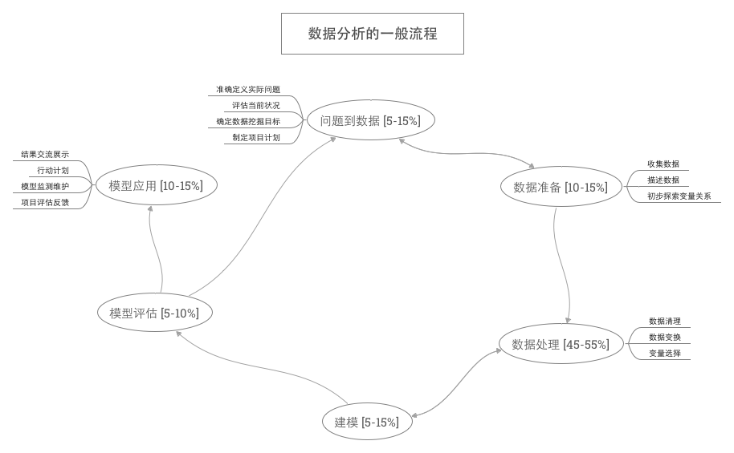
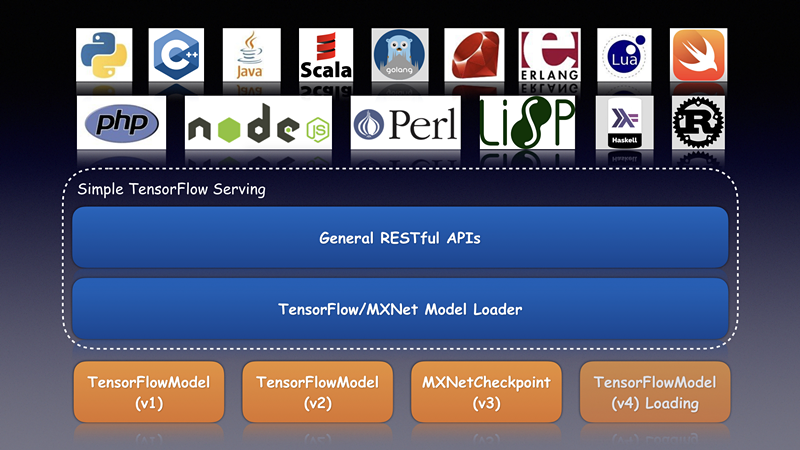

```{r setup, include=FALSE}
library(tufte)
# tufte版本变化之后更新knitr缓存
knitr::opts_chunk$set(tidy = FALSE, cache.extra = packageVersion('tufte'))
options(htmltools.dir.version = FALSE)
```

## 0.说明

文档描述了海尔690PSI大数据算法工程师入职前模型设计能力评估的建模目标，解决思路及设计方案。共三个需求，除提供文档外，可扫描二维码在线阅读。


```{r fig-margin_0, fig.margin = TRUE, fig.cap = "扫码在线预览", fig.width=3.5, fig.height=3.5, cache=TRUE, message=FALSE,echo=FALSE}

```


## 1.智能物流发货计划制定需求

+ 1.需求及可行性分析

    * 需求简介：现有销售订单数据，库存数据，排产数据集、及发货期数据，给当前时刻的所有订单数据全局优化制定出每一单订单的发货日期和发货地点。订单发货的计划需满足最基本的人工发货时遵守的原则，且使得库存最少，运输成本最少及订单实际发货日期与计划发货日期的差值最小。
    * 数据源：销售订单数据，库存数据，排产数据以及计划发货日期数据。
    * 需求确认：首先确认提炼的需求是否合理及在业务层面上有无遗漏，其次确认计划发货日期表的意义。

需求确认后，明确解决问题的方向为**全局优化问题**,优化当前时刻的订单实际发货日期和实际发货地点，使得库存最小，运输成本最低且实际发货日期和计划发货日期最短。

+ 2.建模思路

a.数据清洗及特征工程

实时对当前销售订单数据和库存数据排产数据做统计比如，对于销售订单数据，当前同一目的地的订单数量，同一发货日的订单数量及最近发货日的数量；库存数据，工厂库存量及各地外租库的库存量统计；排产数据，各型号排产数据的数量及下线日期。明确目前库存，排产量及订单量。

b.建模

把人工发货计划遵循规则，转化为优化的约束条件，把库存最小，运输成本最低，及实际发货日期和计划发货日期最短融合为目标函数，构建优化模型（也可以考虑蚁群算法，KM算法，遗传算法等优化算法）^[注：本人对这些优化算法并不熟悉,但有数学底子，上手较快] 同时也可以参考paper: [基于蚂蚁算法的物流配送计划的生成](http://www.docin.com/p-488875291.html),构建优化模型。

+ 3.模型的线上化部署及模型的效果跟踪和优化

模型构建完成经测试没有问题后可做模型线上化的部署，以API接口形式,导入当前订单可生成当前订单的发货计划。过程中做好模型效果的跟踪和模型的优化，同时要有简单易懂的模型调用说明。


## 2.企业类别辨识需求

+ 1.需求及可行性分析

    * 需求简介： ToB部门输入新的企业名称，提供三个最准确的行业
    * 数据源： json数据{企业名:行业},行业类型约20种，共几千条训练数据
    * 需求确认：训练数据的量多大？除企业名外是否有其他和企业相关的数据或允许通过爬虫爬取数据？行业类型后期是否有扩展？

了解清楚以上内容后，即可确认需求，并确定可行的建模方案，建模方向主要有：**文本相似性建模**，**关键词匹配**，**基于内容的推荐**，**监督学习的预测**。


+ 2.建模思路

a.特征工程

基于企业名做分词和词向量(词嵌入)^[TF-IDF,word2vec,Glove等],把非结构化的文本转化成结构化的建模数据，其次如果有和企业相关的其他信息(同时也可以通过爬虫实时爬取)，也可以转化结构化的特征。
    
b.模型训练

*基于文本相似性的建模*，来了新查询企业名，后台构建词向量及其相关的其他特征，计算查询企业与训练库中企业文本相似度排名最高的n个企业，对应的三个行业作为推荐的三个行业。

*基于内容的推荐*：如果有其他额外特征，可以对训练数据的样本进行聚类，并确定每一类中行业（最大频率）,来了查询数据，基于聚类类中心确定该查询属于类别的排序，类别排序对应的前三个行业，即可作为该查询企业的行业推荐。

*关键词匹配*：该建模思路比较简单，主要是做分词，通过分词词组的关键词匹配(正则表达式)，寻找所有匹配到的训练库中的企业，这些企业对应的频率最大的三个行业可以作为推荐行业。

*监督学习预测*：构建好词向量和其他额外的特征后，训练数据的特征即为企业名的词向量及其额外特征，label即为行业，训练机器学习模型（比如简单的决策树，SVM,NB,KNN,随机森林，boosting，bagging,xgboost,lightgbm,catboost等)^[常用监督学习中的生成模型，预测模型，集成学习都可以尝试，做模型选择，特征选择或模型融合],预测出每一个行业的概率，推荐概率排名前三的行业。

+ 3.线下测试

基于训练的模型，开发Web应用^[Python可以选择Flask,Django,R语言可以选择shiny] 或GUI应用^[Python:PyQt,Kivy]，并利用新数据做线下测试，验证模型的有效性，如果有效性无法接受则可以采用多策略融合的办法提升模型的表现。

+ 4.线上部署

测试无问题后把Web服务或GUI应用推动给需求方ToB部门，并附上详细的使用说明和简明易懂的解决方案说明。

+ 5.后期优化

做好跟踪回访和问题反馈的收集，同时模型部署的过程中也会记录新数据及其label,模型更新时作为新的训练数据加入，提升模型查询的准确度和用户体验。


## 3.解决问题的一般思路或者方式

解决问题的一般思路或过程如下：

a.需求分析与确认

需求由业务方提出或算法工程师团队讨论自研型有价值需求，建议直接与需求方沟通跳过产品经理的环节。了解需求后，需要针对于需求转化为算法工程师能解决的逻辑或算法问题，并确认其可行性。需求明了且可行性通过后再去着手研究如何去实现这个需求。这个过程中最好有相应的需求分析的文档和可行性的说明。

b.模型训练与调优

对于数据挖掘，机器学习，深度学习领域的数据清洗，特征工程，模型训练，参数调优，模型融合，可以遵循下面的数据挖掘闭环的思路：

```{r fig-fullwidth-0, fig.width = 10, fig.height = 2, fig.fullwidth = TRUE, fig.cap = "数据挖掘闭环", warning=FALSE, cache=TRUE, message=FALSE,echo=FALSE}


```

c.模型的线上化部署

最终训练的模型需要做成数据产品才可以产生相应的应用价值，传统的数据挖掘和分析仅提留在分析报告的层面，因此需要做好模型的部署和产品化，可以详细的参考我之前写的文档:<https://dataxujing.github.io/tensorflow-serving-Wechat/?transition=convex#/>，内有模型部署的介绍。


```{r fig-fullwidth-1, fig.width = 10, fig.height = 2, fig.fullwidth = TRUE,  fig.cap = "模型部署", warning=FALSE, cache=TRUE, message=FALSE,echo=FALSE}


```

d.模型的追踪与检测

做好模型的日志监测和自学习的更新，同时过程中会通过阅读paper或其他网络资源，会有好的解决方案可以替换，做为模型优化和更新。


